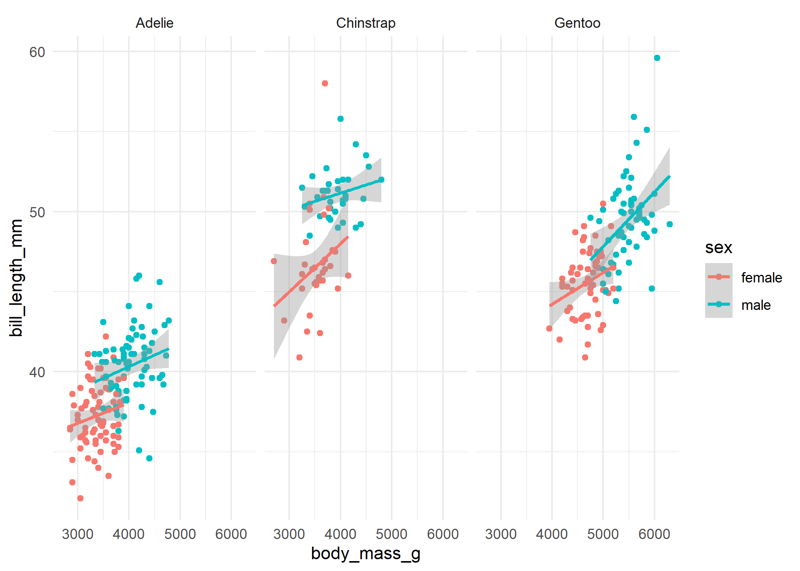
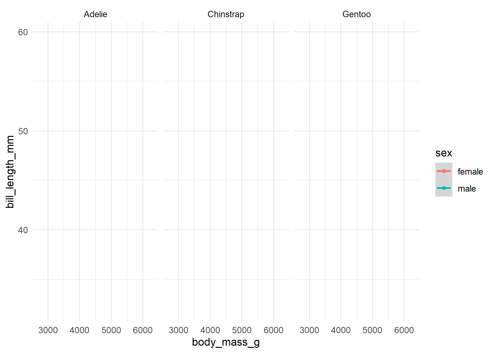
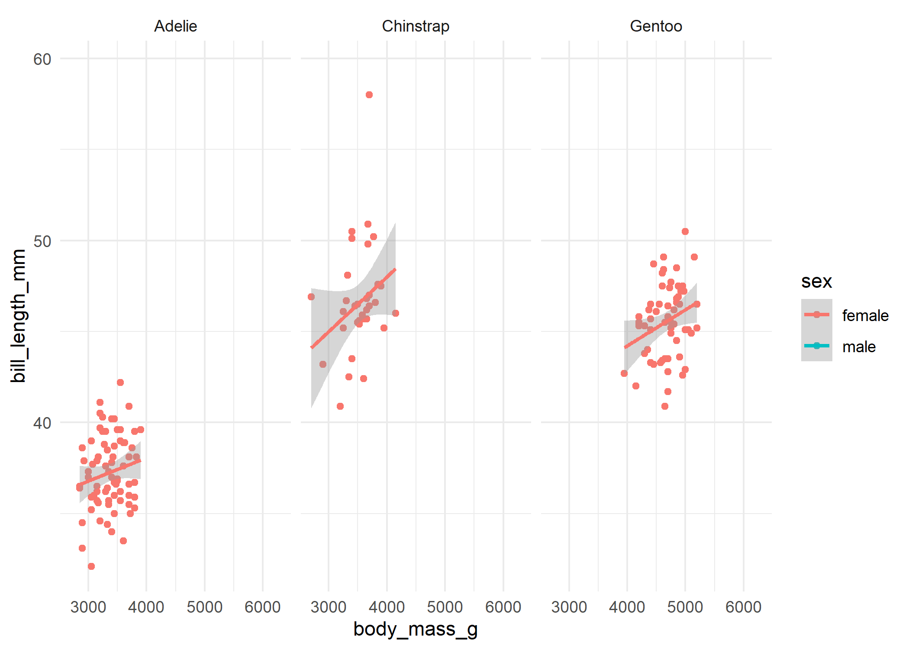

<!-- README.md is generated from README.Rmd. Please edit that file -->

# ggreveal

<!-- badges: start -->

[](https://github.com/weverthonmachado/ggreveal/actions/workflows/R-CMD-check.yaml)
<!-- badges: end -->

The goal of ggreveal is to …

## Installation

``` r
remotes::install_github("weverthonmachado/ggreveal")
```

## Usage

Create a ggplot as you would usually do.

``` r
library(palmerpenguins)
library(ggplot2)

p <-  ggplot(penguins[!is.na(penguins$sex),],
             aes(body_mass_g, bill_length_mm,
                 group=sex, color=sex)) +
      geom_point() +
      geom_smooth(method="lm", formula = 'y ~ x', linewidth=1) +
      facet_wrap(~species) +
      theme_minimal()
p
```



Then use one of `reveal_by_facet`, `reveal_by_group` or
`reveal_by_layer` to obtain a list of plots that show elements
incrementally.

``` r
library(ggreveal)
reveal_by_group(p)
#> [[1]]
```



    #> 
    #> [[2]]



    #> 
    #> [[3]]


