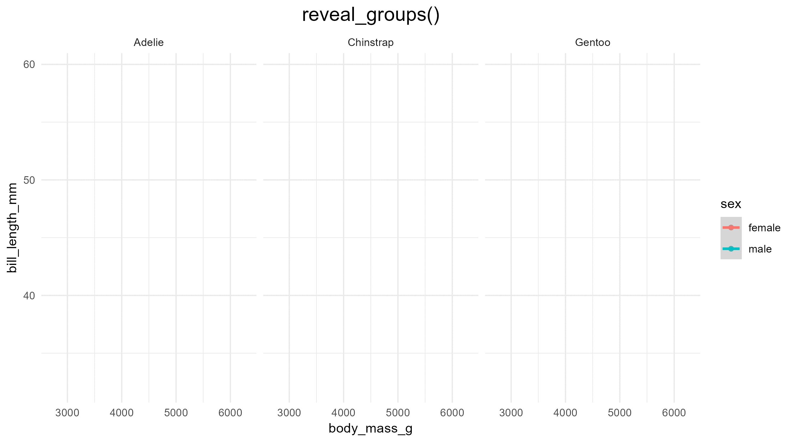

<!-- README.md is generated from README.Rmd. Please edit that file -->

# ggreveal

<!-- badges: start -->

[](https://github.com/weverthonmachado/ggreveal/actions/workflows/R-CMD-check.yaml)
<!-- badges: end -->

`ggreveal` makes it easy to present data on ggplot2 graphs
incrementally. The functions in this package take a plot and break it
down into a series of intermediary plots that can be shown in sequence
(e.g. in different slides). Like this:



*Why* would you want to do that? Because it’s fun — and often very
useful in teaching and academic presentations.

## Installation

``` r
remotes::install_github("weverthonmachado/ggreveal")
```

## Usage

Create a graph with ggplot2 as usual.

``` r
library(palmerpenguins)
library(ggplot2)
library(ggreveal)

p <-  ggplot(penguins[!is.na(penguins$sex),],
             aes(body_mass_g, bill_length_mm,
                 group=sex, color=sex)) +
      geom_point() +
      geom_smooth(method="lm", formula = 'y ~ x', linewidth=1) +
      facet_wrap(~species) +
      theme_minimal()
p
```


Then use one of `reveal_panels()`, `reveal_groups()`, `reveal_layers()`
or `reveal_axis()` to obtain a list of plots that show elements
incrementally.

``` r
plot_list <- reveal_groups(p)
plot_list
#> [[1]]
```


    #> 
    #> [[2]]


    #> 
    #> [[3]]


You probably want to save these graphs using `reveal_save()`, so you can
easily include them later in a presentation:

``` r
reveal_save(plot_list, "myplot.png", width = 8, height = 4)
```

    ── Saving incremental plots ──

    ✔ myplot_0.png
    ✔ myplot_1.png
    ✔ myplot_2_last.png


# <a id="why"></a> Wait, can’t ggplot2 do this already?

Yes and no. `ggplot2` is composable by design, so it is straightforward
to do some incremental reveal out of the box. For example, you can
create the plot in steps and save the steps separately:

``` r
data("mtcars")
p1 <- ggplot(mtcars, 
            aes(mpg, wt)) +
     geom_point() 
     
p2 <- p1 + geom_smooth(method="lm", formula="y~x") 
```

The problem is: as you add layers and other elements, several visual
aspects of the plot — e.g. range of axes, legends — can, and will often,
change. Showing how the layout changes as you add elements is useful for
teaching *how to make graphs in ggplot2*, but it is distracting when you
want to focus on the *results*. Keeping the layout fixed is sometimes
easy (e.g. set the `limits` argument for the x/y scale), but in many
cases it requires tinkering with the internals of the ggplot object.
