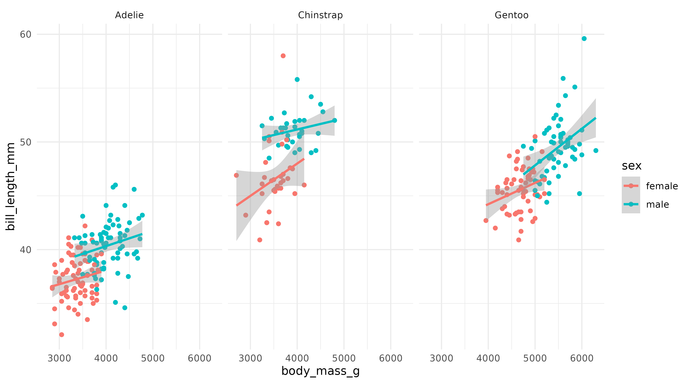
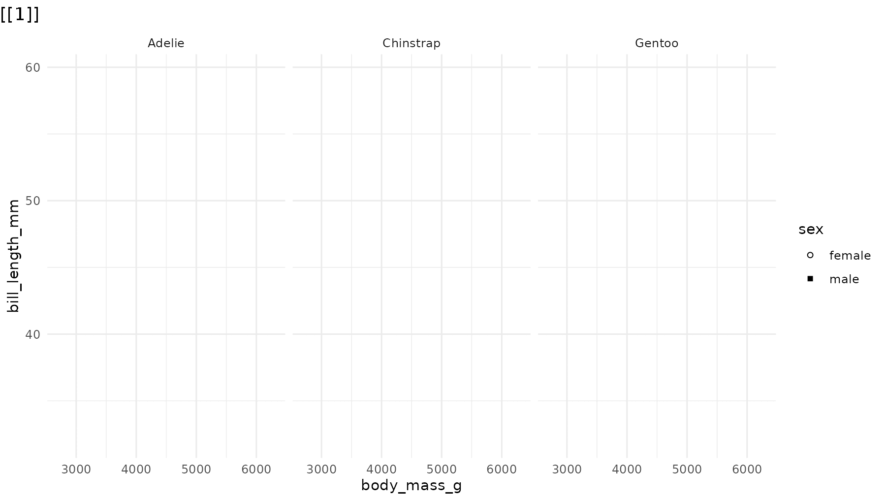
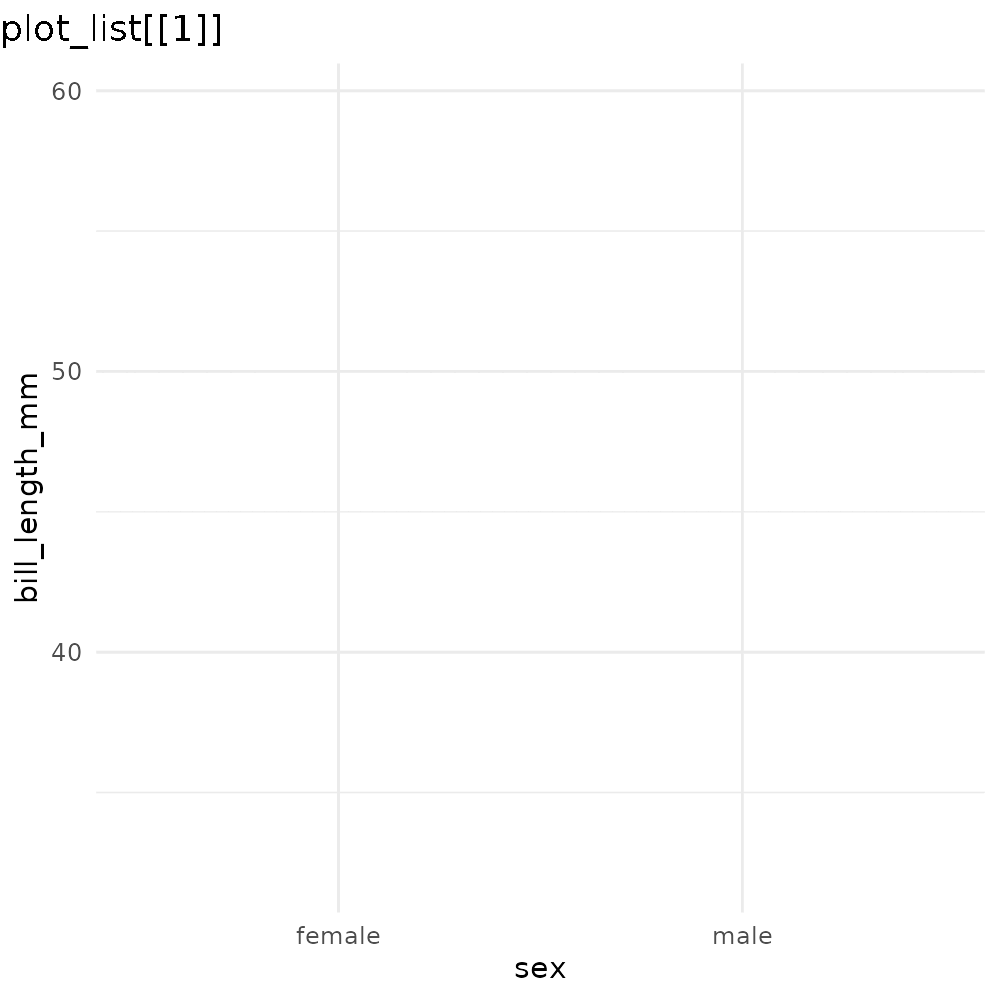
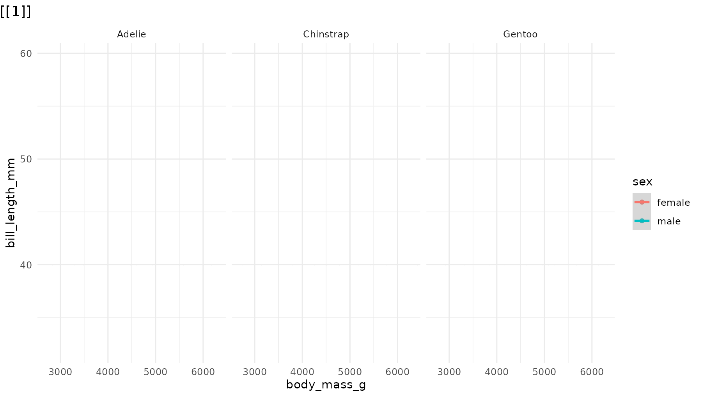
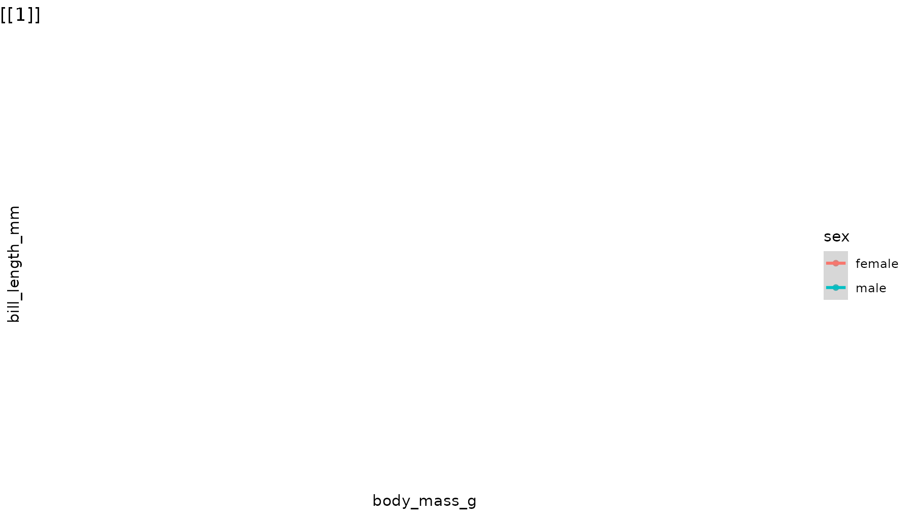
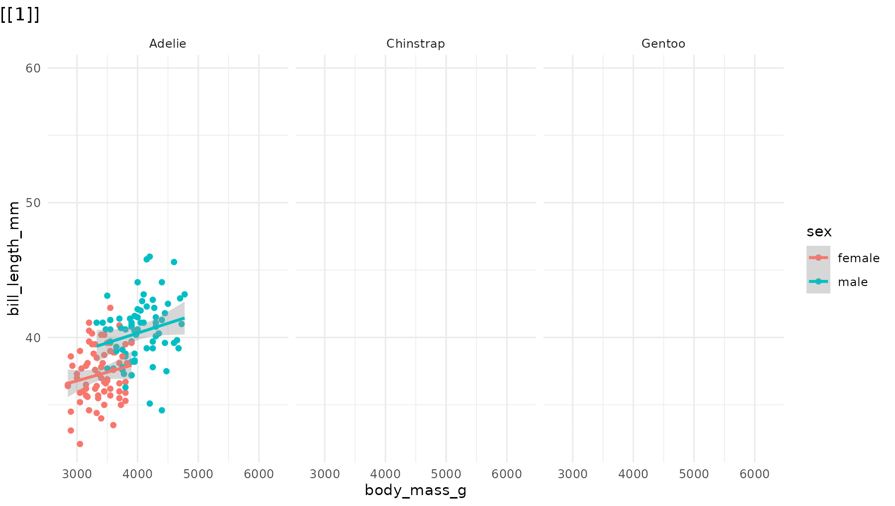
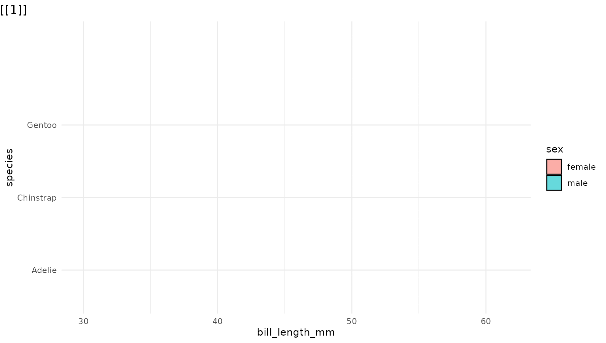
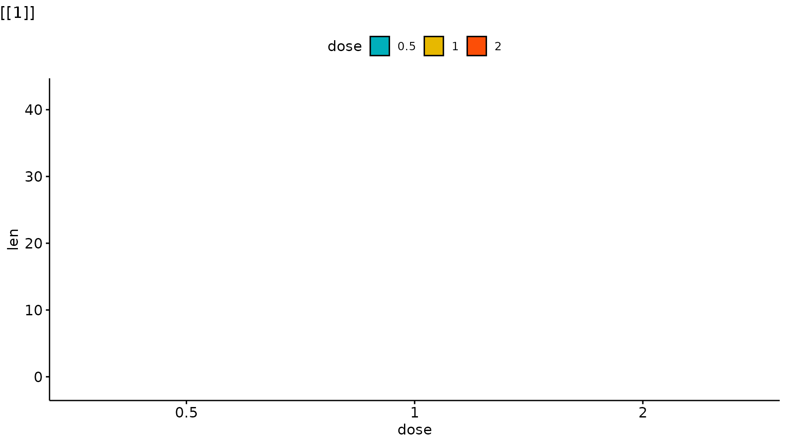
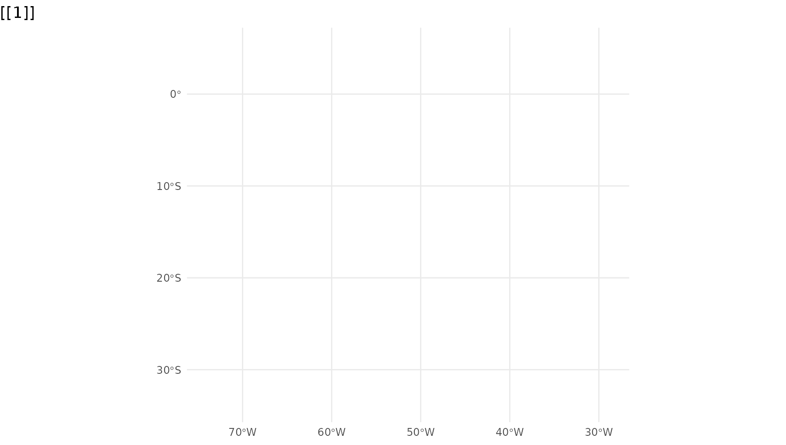

# Get Started

The goal of ggreveal is to make it easy to incrementally reveal parts of
a ggplot. The package offers several ways to split a finished plot into
a sequence of steps, each showing a bit more than the last.

For the examples below, we will use the `penguins` dataset from
[`palmerpenguins`](https://allisonhorst.github.io/palmerpenguins/),
which contains measurements of penguins from three species.

``` r
library(palmerpenguins)
library(ggplot2)
library(ggreveal)

penguins <- penguins[!is.na(penguins$sex), ]

p1 <- ggplot(penguins,
             aes(x = body_mass_g,
                 y = bill_length_mm,
                 color = sex)) +
      geom_point() +
      geom_smooth(method = "lm", formula = "y ~ x", linewidth = 1) +
      facet_wrap(~species) +
      theme_minimal()

p1
```



*Note: ggreveal does not produce animations. All functions return a
**list of ggplot objects**. The animated GIFs here are just a compact
way to display that list.*

## Reveal by aesthetic

[`reveal_aes()`](http://www.weverthon.com/ggreveal/reference/reveal_aes.md)
splits the plot by the levels of any aesthetic mapping. Here, sex is
mapped to color, so `reveal_aes(p1, aes = "color")` produces a list with
three plots: first a blank layout, then a plot adding male penguins, and
finally one that adds female penguins.

``` r
reveal_aes(p1, aes = "color")
```


By default, the first plot in the list is the blank frame showing only
layout elements (axes, legend, facet labels, etc) with no data, and the
last plot is identical to the original plot. See section [Controlling
reveal order](#order) for how to modify this behaviour.

[`reveal_aes()`](http://www.weverthon.com/ggreveal/reference/reveal_aes.md)
accepts any aesthetic. Mapping sex to shape instead:

``` r
p2 <- ggplot(penguins,
             aes(x = body_mass_g,
                 y = bill_length_mm,
                 shape = sex)) +
      geom_point() +
      geom_smooth(method = "lm", formula = "y ~ x", linewidth = 1) +
      facet_wrap(~species) +
      scale_shape_manual(values = c(1, 15)) +
      theme_minimal()

reveal_aes(p2, aes = "shape") 
```



Note that even though
[`geom_smooth()`](https://ggplot2.tidyverse.org/reference/geom_smooth.html)
does not use the `shape` aesthetic,
[`reveal_aes()`](http://www.weverthon.com/ggreveal/reference/reveal_aes.md)
also groups the lines by sex because `shape` was defined in the global
call to [`aes()`](https://ggplot2.tidyverse.org/reference/aes.html). If
`shape` were defined only inside
[`geom_point()`](https://ggplot2.tidyverse.org/reference/geom_point.html),
the regression lines would all appear together in a single step.

[`reveal_x()`](http://www.weverthon.com/ggreveal/reference/reveal_axis.md)
and
[`reveal_y()`](http://www.weverthon.com/ggreveal/reference/reveal_axis.md)
are shortcuts for `reveal_aes(aes = "x")` and `reveal_aes(aes = "y")`.
They work best when the axis variable is discrete or has only a few
values:

``` r
p3 <- ggplot(penguins,
             aes(x = sex, y = bill_length_mm)) +
      geom_boxplot() +
      theme_minimal()

reveal_aes(p3, aes = "x") 
```



If you find yourself needing to incrementally reveal a large number of
values (e.g. a time series developing over the x axis), you might want
to use [`gganimate`](https://gganimate.com/) instead.

[`reveal_groups()`](http://www.weverthon.com/ggreveal/reference/reveal_groups.md)
is equivalent to `reveal_aes(aes = "group")`. It is useful when groups
are implicit (ggplot2 automatically groups data by the interaction of
all discrete variables).

## Reveal by panel/facet

[`reveal_panels()`](http://www.weverthon.com/ggreveal/reference/reveal_panels.md)
reveals one facet at a time. By default (`what = "data"`) the layout
elements are visible from the start, and only the geoms appear
incrementally. Again, the last element in the list corresponds to the
original plot:

``` r
reveal_panels(p1) 
```



Set `what = "everything"` to incrementally reveal entire panels,
including their axes and labels:

``` r
reveal_panels(p1, what = "everything")
```



## Reveal by layer

[`reveal_layers()`](http://www.weverthon.com/ggreveal/reference/reveal_layers.md)
shows, you guessed it, one layer at a time. Here, the points appear
first, then the regression lines are added on top:

``` r
reveal_layers(p1)
```


## Reveal a patchwork

[`reveal_patchwork()`](http://www.weverthon.com/ggreveal/reference/reveal_patchwork.md)
works on composite figures built with the
[patchwork](https://patchwork.data-imaginist.com/) package, revealing
one constituent plot at a time. The first element in the list shows the
overall patchwork layout with all child plots blanked out. Each
subsequent element adds one more child plot, in the order they were
composed. The final element matches the original patchwork.

``` r
library(patchwork)

p4 <- ggplot(penguins, aes(x = species)) +
      geom_bar() +
      theme_minimal()

pw <- p1 / (p3 + p4)

reveal_patchwork(pw)
```


## Controlling reveal order

The main `reveal_*` functions accept an `order` argument: a numeric
vector that specifies which elements to reveal and in what sequence.
This lets you:

*Reorder* the sequence. For example, to reveal species in reverse order
in
[`reveal_panels()`](http://www.weverthon.com/ggreveal/reference/reveal_panels.md):

``` r
# Default: Adelie → Chinstrap → Gentoo
# Reversed: Gentoo → Chinstrap → Adelie
reveal_panels(p1, order = c(3, 2, 1))
```


*Skip elements.* Omit a step entirely by leaving its index out:

``` r
# Only reveal Adelie (panel 1) and Gentoo (panel 3), skipping Chinstrap
reveal_panels(p1, order = c(1, 3))
```


*Drop the blank opening frame* by including `-1` in the order vector:

``` r
# Start directly with data, no blank frame
reveal_panels(p1, order = c(-1, 1, 2, 3))
```



The same `order` argument works identically across
[`reveal_aes()`](http://www.weverthon.com/ggreveal/reference/reveal_aes.md),
[`reveal_groups()`](http://www.weverthon.com/ggreveal/reference/reveal_groups.md),
[`reveal_layers()`](http://www.weverthon.com/ggreveal/reference/reveal_layers.md),
[`reveal_panels()`](http://www.weverthon.com/ggreveal/reference/reveal_panels.md),
and
[`reveal_patchwork()`](http://www.weverthon.com/ggreveal/reference/reveal_patchwork.md).

## Saving incremental plots

[`reveal_save()`](http://www.weverthon.com/ggreveal/reference/reveal_save.md)
saves each plot in the list to a numbered file using
[`ggsave()`](https://ggplot2.tidyverse.org/reference/ggsave.html). Any
extra arguments (e.g. `width`, `height`) are forwarded directly to
[`ggsave()`](https://ggplot2.tidyverse.org/reference/ggsave.html):

``` r
reveal_save(plot_list, "myplot.png", width = 9, height = 5)
```

This produces files like `myplot_0.png`, `myplot_1.png`,
`myplot_2_last.png`.

## Examples with other ggplot2 extensions

Because they manipulate basic components of a ggplot object (layers,
geoms, facets), the functions in ggreveal should work with most ggplot2
extensions.[¹](#fn1) Some examples:

``` r
library(ggridges)

p_ridges <- ggplot(penguins,
                   aes(x = bill_length_mm,
                       y = species,
                       fill = sex)) +
            geom_density_ridges(alpha = 0.6) +
            theme_minimal()

reveal_y(p_ridges)
```



``` r
# Adapted from ggpubr docs
library(ggpubr)
data("ToothGrowth")
my_comparisons <- list( c("0.5", "1"), c("1", "2"), c("0.5", "2") )

p_ggpubr <- ggviolin(ToothGrowth, x = "dose", y = "len", fill = "dose",
                    palette = c("#00AFBB", "#E7B800", "#FC4E07"),
                   add = "boxplot", add.params = list(fill = "white")) +
            stat_compare_means(comparisons = my_comparisons, label = "p.signif")

reveal_layers(p_ggpubr)
```



``` r
library(geobr)
library(sf)
library(ggmapinset)

states <- read_state()
campos <- read_municipality(code_muni=3301009)
rj <- read_municipality(code_muni=3304557)

inset1 <- configure_inset(
  shape_circle(
    centre =  st_centroid(campos),
    radius = 70
  ),
  scale = 4,
  translation = c(450, 0)
)

inset2 <- configure_inset(
  shape_circle(
    centre =  st_centroid(rj),
    radius = 70
  ),
  scale = 4,
  translation = c(0, -450)
)

p_br <- ggplot() +
      geom_sf(data = states, 
              group = 1) +

      geom_sf_inset(data = campos, 
                    inset = inset1,
                    fill = "#00BFC4",
                    group = 2) +
      geom_inset_frame(inset = inset1, 
                       group = 2) +
      
      geom_sf_inset(data = rj, 
                    inset = inset2,
                    fill = "#00BFC4",
                    group = 3) +
      geom_inset_frame(inset = inset2,
                       group = 3) +
      theme_minimal() 

reveal_aes(p_br, "group")
```



------------------------------------------------------------------------

1.  Unless the extension modifies the internal structure of the ggplot
    object, like `patchwork` does.
